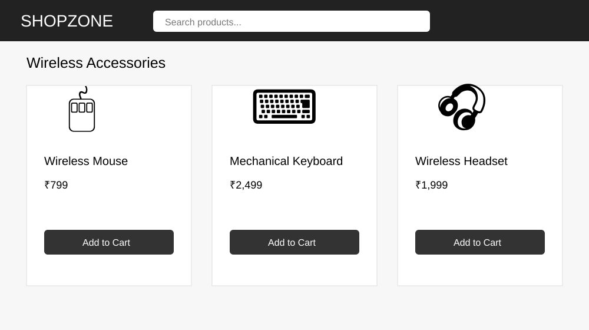
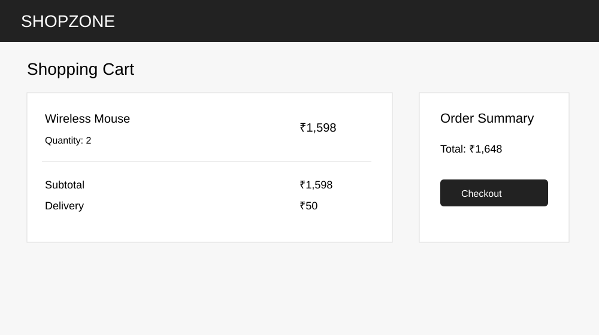
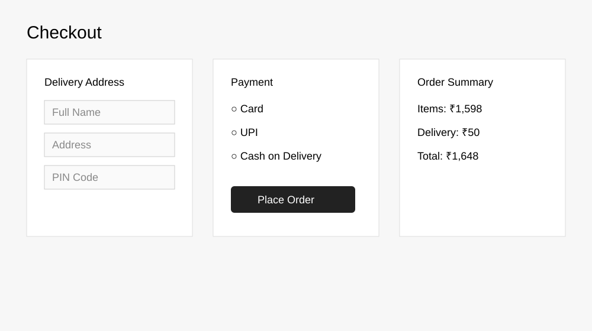

# 🛒 E-Commerce Website Testing

A portfolio-ready **E-Commerce QA project** combining Manual Testing, SQL validation, and Selenium WebDriver automation using Java, JUnit 5, Maven, and Page Object Model (POM).

## 🎯 Objective

Validate critical e-commerce user journeys including login, product search, product selection, shopping cart, checkout, order confirmation, negative scenarios, and regression-oriented checks.

## 🧪 Manual Testing Coverage

- Functional testing
- UI testing
- Positive & negative testing
- Boundary Value Analysis
- Equivalence Partitioning
- Smoke & sanity testing
- Regression testing
- Usability testing
- Cross-browser testing checklist
- Test case design
- Defect reporting
- Test execution documentation

## 🤖 Automation Testing

The automation framework is implemented using:

- **Java 17**
- **Selenium WebDriver 4.25.0**
- **JUnit 5.11.0**
- **Maven**
- **Page Object Model (POM)**
- **Chrome WebDriver**
- **Maven Surefire**

The automation targets the public SauceDemo test application: `https://www.saucedemo.com/`

### Automated Scenarios

| Test | Scenario | Validation |
|---|---|---|
| 1 | Valid Login | Products page opens and title is validated |
| 2 | Invalid Login | Login error message is displayed |
| 3 | Add Product to Cart | Cart count is validated as 1 |
| 4 | Cart Product Validation | Selected product is displayed in cart |
| 5 | Checkout Flow | Customer details, checkout and order confirmation are validated |

## 🧱 Automation Framework Structure

```text
E-Commerce-Website-Testing/
├── README.md
├── pom.xml
├── Bug-Reports/
│   └── Sample_Bug_Reports.md
├── SQL/
│   └── validation_queries.sql
├── Test-Cases/
│   └── ECommerce_Test_Cases.md
├── Test-Data/
│   └── ecommerce_test_data.csv
├── Test-Plan/
│   └── Test_Plan.md
├── Test-Execution/
│   └── Execution_Summary.md
├── Screenshots/
│   ├── product-listing.svg
│   ├── shopping-cart.svg
│   └── checkout-flow.svg
└── src/
    └── test/
        └── java/
            └── com/keerthi/qa/
                ├── BaseTest.java
                ├── LoginPage.java
                ├── ProductPage.java
                ├── CartPage.java
                ├── CheckoutPage.java
                └── EcommerceSmokeTest.java
```

## 🧩 Page Object Model

The framework separates page locators and actions from test cases:

- `BaseTest.java` — Chrome WebDriver setup and teardown
- `LoginPage.java` — login actions and error validation
- `ProductPage.java` — product and cart actions
- `CartPage.java` — cart validation and checkout navigation
- `CheckoutPage.java` — customer details and order completion
- `EcommerceSmokeTest.java` — JUnit test scenarios

This structure improves **maintainability, readability, and reusability** of the automation suite.

## ▶️ How to Run Automation

### Prerequisites

- Java 17+
- Maven 3.8+
- Google Chrome
- Internet connection

### Run Tests

```bash
mvn clean test
```

Maven Surefire executes the JUnit tests and generates test results under:

```text
target/surefire-reports/
```

## 📋 Manual Test Cases

The project contains test scenarios covering:

- Valid and invalid product search
- Add product to cart
- Update quantity
- Remove product
- Invalid coupon
- Checkout validation
- Successful order
- Price calculation
- Cart/session persistence

See: `Test-Cases/ECommerce_Test_Cases.md`

## 🗄️ SQL Validation

SQL validation queries are included for database-oriented QA checks such as:

- Product and category validation
- Search result validation
- Cart validation
- Order total validation
- Pending/failed order checks

See: `SQL/validation_queries.sql`

> The SQL queries are representative QA validation examples and are not connected to a production database.

## 🐞 Defect Reporting

Sample defects use a professional QA format including:

- Defect ID
- Summary
- Severity
- Priority
- Steps to reproduce
- Expected result
- Actual result
- Status

See: `Bug-Reports/Sample_Bug_Reports.md`

## 📸 Project Screenshots

### 1. Product Listing



### 2. Shopping Cart



### 3. Checkout Flow



> These screenshots are **demonstration UI mockups created for portfolio documentation**. They are not presented as proof of live production execution.

## 🛠️ Tools & Technologies

**Testing:** Manual Testing, Functional Testing, Regression Testing, Smoke Testing, Sanity Testing, Positive/Negative Testing  
**Automation:** Selenium WebDriver, Java, JUnit 5, Page Object Model  
**Build:** Maven, Surefire  
**Database:** SQL  
**Documentation:** Test Cases, Test Plan, Test Data, Bug Reports, Test Execution  
**Tools:** Git, GitHub, Chrome DevTools

## 💡 What This Project Demonstrates

- End-to-end e-commerce test scenario design
- Manual test case creation and execution documentation
- Defect identification and reporting
- SQL-based validation approach
- Selenium WebDriver automation
- Page Object Model implementation
- JUnit test execution and assertions
- Maven-based test project setup
- Positive and negative test automation

## 👤 Author

**Keerthi Kandula** — Aspiring QA Engineer / Software Tester
